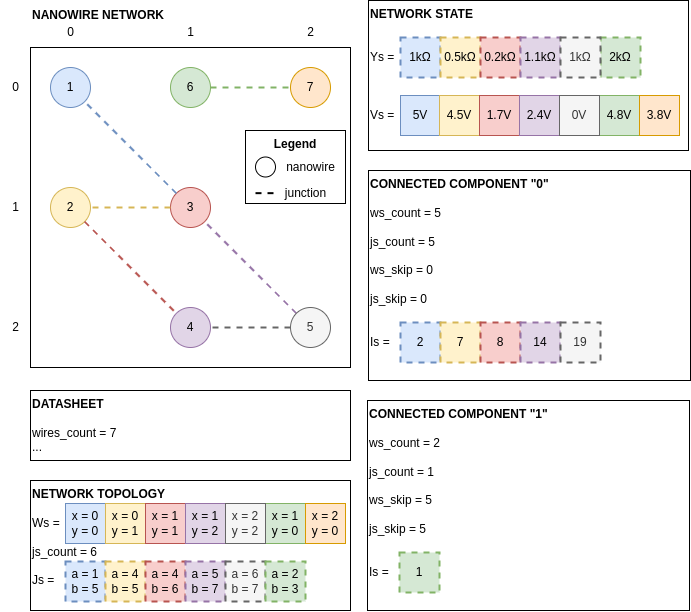

# NNS: Nanowire Network Simulator

`nns.c` is a C library that provides types and functions for the high performance simulation of Nanowire Networks.
Specifically, it focuses on the randomly-created devices developed at the Polytechnic of Turin by Gianluca Milano, Enrique Miranda and Carlo Ricciardi.
The code allows performing analysis of the structural and functional connectivity of the memristive network.
The library is inspired by the code used in the paper [_Connectome of memristive nanowire networks through graph theory_](https://doi.org/10.1016/j.neunet.2022.02.022), which can be found here [here](https://github.com/MilanoGianluca/Memristive_Nanowire_Networks_Connectome).

## Requirements
- LAPACK with the C interface LAPACKE
- OpenBLAS for the parallelization of the LAPACK routines
- OpenMP for the parallelization of some simulator routines
- [OPTIONAL] Doxygen for the generation of the documentation

## Instructions
1. To compile the source code, examples, and tests: `cmake . && make`</br>
2. To install the library system-wide [requires 1]: `sudo make install`</br>
3. To run the examples [requires 1]: `time ./examples/[EXAMPLE NAME].elf`</br>
4. To run the tests [requires 1]: `cd tests && ctest; cd ..`</br>
5. To run Valgrind memory-leak tests [requires 1 and 2]: `valgrind --leak-check=yes --log-file=valgrind.rpt examples/[EXAMPLE NAME].elf`</br>

A common usage is:
```
$ cmake . && make && sudo make install
$ ulimit -s 65535
$ cd tests && ctest; cd ..
$ time ./examples/basic.elf
```

## Design

The main components of the simulator are:
1. Datasheet: Represents the static information of the Nanowire Network, such as the number of nanowires, their length, etc.
2. Network topology: Contains the physical distribution of the nanowires and their junctions.
3. Network state: Contains the dynamic (or instantaneous) state of the Nanowire Network, represented as the equivalent electrical circuit.
4. Connected component: Represents a connected group of nanowires inside the Nanowire Network, and contains the information to address them in the `network state'.

An example of their relationship is shown in the following diagram:



## Troubleshoot
- [IMPORTANT] A segmentation fault may happen if too large networks are simulated. To solve this problem it is simply needed to increase the memory that the program can allocate. See: `ulimit -s 65535`.
- The Valgrind test [does not work correctly](https://medium.com/@auraham/pseudo-memory-leaks-when-using-openmp-11a383cc4cf9) when used with OpenMP. Therefore, to perform the test is necessary to compile the library without OpenMP and with a sequential implementation of BLAS.
